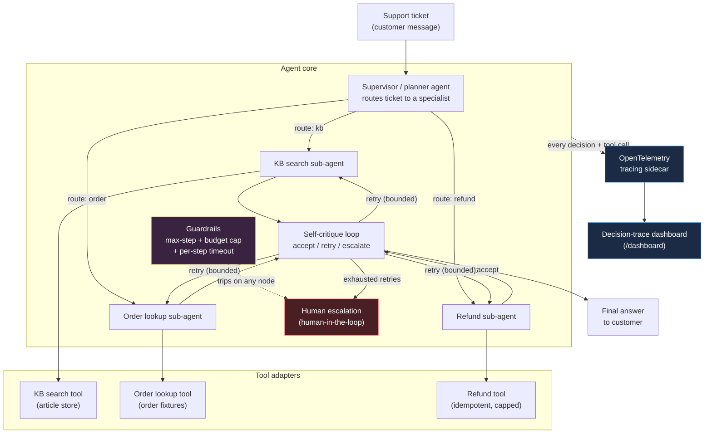

# agentops-sentinel

**A supervisor/critique agent framework for support-ticket triage - reliable, cost-bounded, and fully traced.**


> Bounded, observable, self-correcting agentic workflows for support-ticket triage: a planner routes to specialized tool-using sub-agents, a self-critique loop retries or escalates, and every decision is traced end-to-end.

## The real problem

Teams shipping agentic features run into the same wall: multi-step agent workflows are unreliable (one bad tool call derails the whole run), unobservable (nobody can say why the agent took a wrong action after the fact), and cost-unbounded (a stuck retry loop can burn an unbounded number of LLM calls before anyone notices). Most "agent demos" skip straight past this - a single LLM call with a couple of tools, no supervision, no budget, no trace.

`agentops-sentinel` is a concrete, working answer to that problem in one real domain: support-ticket triage. A supervisor/planner routes each ticket to a specialized sub-agent (knowledge base, order lookup, or refunds); a self-critique pass reviews every sub-agent result and decides to accept it, retry, or escalate to a human; every decision and tool call is captured as an OpenTelemetry span and rendered in a small decision-trace dashboard; and hard guardrails - a step limit, a dollar budget, and a per-step timeout - guarantee the whole thing terminates, on budget, even when tools fail or the agent gets stuck.

## Architecture



**Reading it**: the supervisor is the only entry point - it inspects the ticket and picks exactly one specialist. That specialist calls its tool, and the result always passes through the self-critique loop before anything is returned to the customer. Retries loop back to the same specialist, bounded by both a per-task retry cap and the run's overall step/budget guardrails. Guardrail trips (budget exceeded, step limit hit, step timeout) short-circuit straight to human escalation from anywhere in the graph. Every node emits an OpenTelemetry span, mirrored into an in-process store that the `/dashboard` page renders as a timeline.

## Quick start

Requires Python 3.11+.

```bash
python3.11 -m venv .venv && source .venv/bin/activate
pip install -r requirements-dev.txt
pip install -e .

# Run the tests (fully offline - no API keys, no Docker, no network)
pytest -q

# Run the API + dashboard
uvicorn agentops_sentinel.api.app:app --reload
# then open http://127.0.0.1:8000/dashboard
```

Submit a ticket and watch its trace appear on the dashboard:

```bash
curl -s -X POST http://127.0.0.1:8000/tickets \
  -H "content-type: application/json" \
  -d '{"ticket_text": "Where is my order ORD-1001?"}' | python -m json.tool
```

Or with Docker:

```bash
docker build -t agentops-sentinel .
docker run -p 8000:8000 agentops-sentinel
```

### Using a real LLM (optional)

By default everything runs against `FakeLLMClient` - a deterministic, keyword/heuristic reasoner that exercises the exact same control flow (routing, retries, escalation) as a real model, with zero network calls. To use a real model instead:

```bash
export AGENTOPS_LLM_PROVIDER=anthropic   # or "openai"
export ANTHROPIC_API_KEY=sk-ant-...      # or OPENAI_API_KEY
```

If the provider is set but the matching API key is absent, the system silently falls back to the fake client rather than failing - "offline by default" is the safe path.

## How it works

1. **Supervisor / planner** (`agents/supervisor.py`) reads the ticket text and routes it to exactly one of three specialists - `kb_agent`, `order_agent`, `refund_agent` - or straight to `escalate` if the ticket looks hostile, mentions legal action/fraud, or is too ambiguous to route confidently.
2. **Specialized sub-agents** (`agents/kb_agent.py`, `order_agent.py`, `refund_agent.py`) each own one real tool: a keyword-ranked knowledge-base search, an order-status lookup, and an idempotent refund processor that enforces "can't refund more than the order total." The refund agent chains both tools - it looks up the order total before refunding when the ticket doesn't specify an amount.
3. **Self-critique loop** (`agents/critique.py`) reviews every sub-agent result - its confidence score and whether its tool call errored - and decides `accept`, `retry` (bounded by `AGENTOPS_MAX_RETRIES_PER_TASK`), or `escalate`. Transient tool failures get one retry; permanent failures or persistently low confidence escalate instead of looping forever.
4. **Guardrails** (`guardrails.py`) wrap every node: a hard step-count ceiling (`AGENTOPS_MAX_STEPS`), a dollar budget charged per LLM/tool call (`AGENTOPS_BUDGET_USD`), and a per-step wall-clock timeout (`AGENTOPS_STEP_TIMEOUT_S`) run in a worker thread so a hung step can't hang the whole process. Any trip routes straight to human escalation.
5. **Tracing sidecar** (`tracing.py`) wraps every supervisor decision, sub-agent execution, critique review, and escalation as an OpenTelemetry span, mirrored into an in-process `DecisionTraceStore`. The FastAPI app (`api/app.py`) exposes it at `/traces/{id}` and renders it as a timeline at `/dashboard` - no OTel collector required to see a trace, though `configure_tracing(console_export=True)` or a real OTLP exporter can be added for production.
6. **Human escalation** is a first-class terminal state, not an error path: `/tickets/{id}` reports `status: "escalated"` with a structured `escalation_reason` (which guardrail tripped, or why the critique loop gave up), ready to hand off to a human agent.

### Project layout

```
src/agentops_sentinel/
  agents/        supervisor, kb/order/refund sub-agents, self-critique
  tools/         kb search, order lookup, refund (bundled fixtures, no DB/network)
  api/           FastAPI app (submit tickets, fetch runs/traces, dashboard)
  dashboard/     static decision-trace dashboard (vanilla HTML/JS)
  graph.py       the LangGraph StateGraph wiring it all together
  guardrails.py  step/budget/timeout guards
  tracing.py     OpenTelemetry sidecar + in-process trace store
  llm.py         LLMClient abstraction: FakeLLMClient (default) / Anthropic / OpenAI
  store.py       session/run store (in-memory, or Redis via fakeredis-tested code path)
  runner.py      AgentRunner - the public "run one ticket" entry point
tests/           84 unit/integration tests (pytest), one Docker/Redis test skipped by default
```

## Testing

```bash
pytest -q                                    # full offline suite
pytest -q --cov=agentops_sentinel            # with coverage
pytest -q -m integration                     # optional: needs a real Redis (skipped by default)
```

The suite covers: tool successes/failures/edge cases, guardrail trips (budget, step limit, timeout), the deterministic LLM router and critique logic, full graph runs for every route (KB/order/refund), transient-tool-failure recovery via retry, permanent-tool-failure escalation, budget/step-exceeded escalation, direct supervisor escalation for hostile tickets, tracing span capture/isolation, the Redis-backed and in-memory session stores, and the FastAPI surface end-to-end.

## Maintainer

This project is maintained by **Manmohan S.**, a Supply Chain Analyst and Developer focused on building reliable, automated workflows for operational environments. With a background in supply chain analytics and process improvement, I develop tools that bridge the gap between complex data operations and agentic AI.

**Contact:**
- Email: manmohansangola1@gmail.com
- LinkedIn: https://www.linkedin.com/in/manmohan-sangola/

## License

MIT - see [LICENSE](LICENSE).